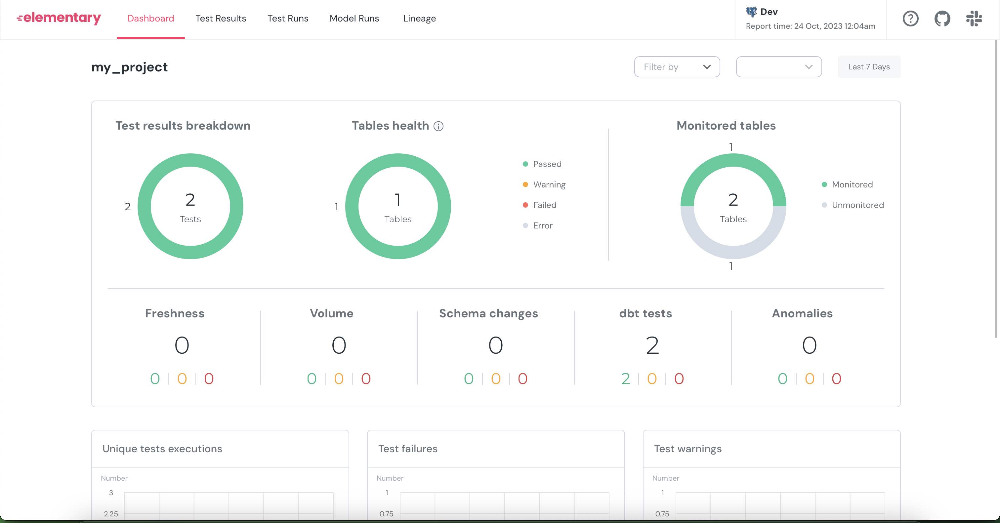
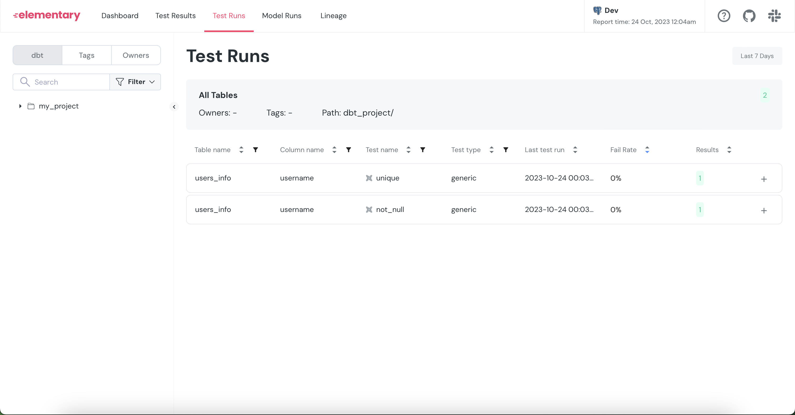
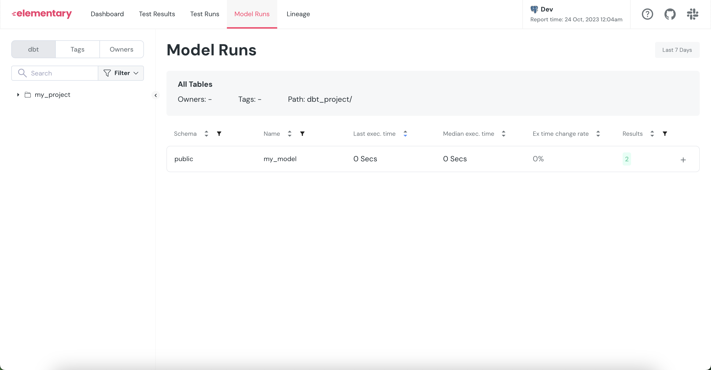

# Elementary Data test project 

## Prerequisites
- Docker
- A web browser
- 5 minutes of your time

## Objective
The goal of this project is to test the elementary-data project directly, with a sample model and two tests.

## How to Test this Project

1. Clone the project and navigate to the project folder:
```bash
git clone https://github.com/fjpulidop/elementary-data-tutorial.git 
cd elementary-data-tutorial
```

2. Run the following Docker Compose command:
```bash
docker-compose up --force-recreate --build -d
```
(wait 1-2 minutes)

3. If you wish to see the logs of the Docker Compose and observe the results of the tests performed by DBT using Great Expectations, execute:
```bash
docker-compose logs -f
```

4. To view the Great Expectations web interface, where you can see tests written in Python:
- Navigate to the dbt_project/edr_target folder.
- Open the elementary_report.html file in a web browser.




I hope you find this helpful!
